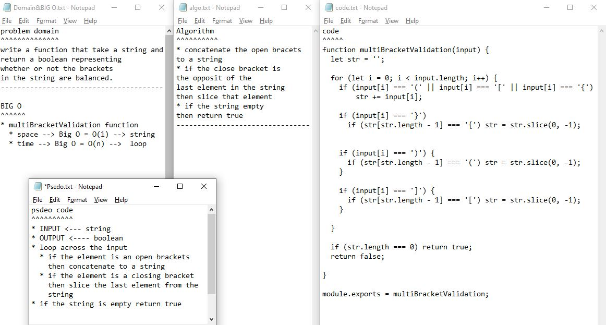

## Github actions
[link](https://github.com/ruwaid-401-advanced-javascript/data-structures-and-algorithms/pull/12/checks)

# Multi Bracket Validation

Function 

## Challenge

function to return true if the bracets are balanced and false if not  

## Approach & Efficiency

i used loops and if  
### BIG O
#### multi-bracket-validation
* multiBracketValidation function
  * space --> Big O = O(1) --> string
  * time --> Big O = O(n) -->  loop

## Solution

