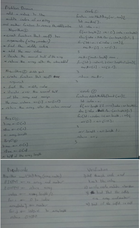

## Github actions
[link](https://github.com/ruwaid-401-advanced-javascript/data-structures-and-algorithms/pull/2/checks)

# shift an Array and add new element

loops (for,while)

## Challenge

function that take an array and a number and add the number to the middle index of the array

## Approach & Efficiency

i used loops because i need to loop across all the elements to change the array
space --> Big O = O(n)
time --> Big O =O(n)

## Solution

