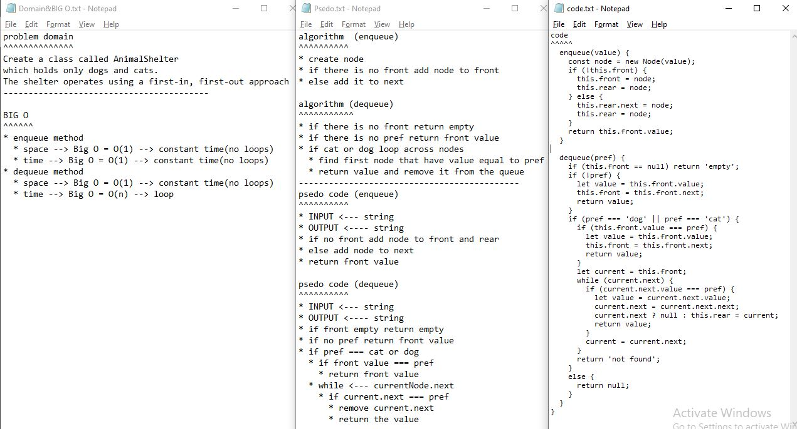

## Github actions
[link](https://github.com/ruwaid-401-advanced-javascript/data-structures-and-algorithms/pull/13/checks)

# Animal shelter

loops (while)

## Challenge
Create a class called AnimalShelter which holds only dogs and cats. The shelter operates using a first-in, first-out approach.

## Approach & Efficiency

i used loops because i need to loop across node until to find the first prefered element
* enqueue method
  * space --> Big O = O(1) --> constant time(no loops)
  * time --> Big O = O(1) --> constant time(no loops)
* dequeue method
  * space --> Big O = O(1) --> constant time(no loops)
  * time --> Big O = O(n) --> loop

## Solution

