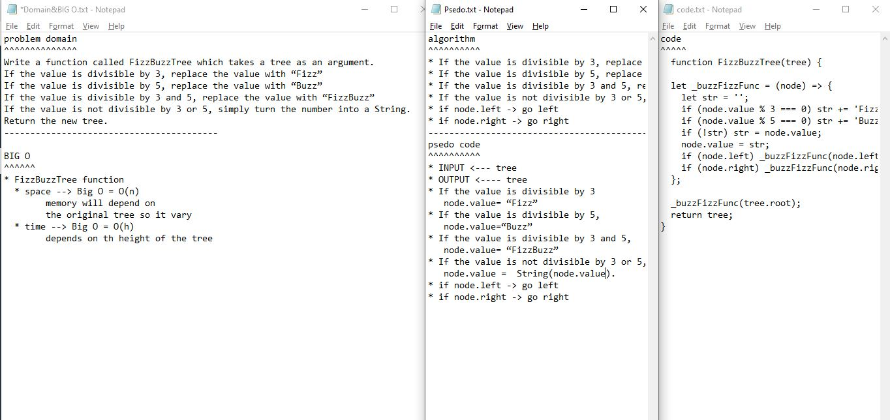

## Github actions
[link](https://github.com/ruwaid-401-advanced-javascript/data-structures-and-algorithms/pull/15/checks)

# Tree

function to create new tree 

## Challenge

function that to change number to string

## Approach & Efficiency

i used recurssion
### BIG O
#### Binary Search Tree 
* FizzBuzzTree function
  * space --> Big O = O(n) --> memory will depend on the original tree so it vary
  * time --> Big O = O(h) --> depends on th height of the tree

## Solution

