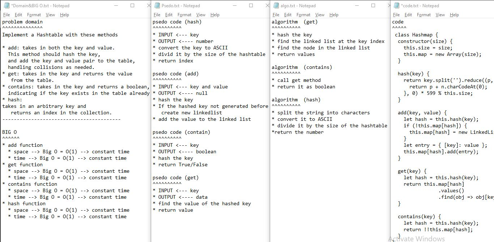

## Github actions
[link](https://github.com/ruwaid-401-advanced-javascript/data-structures-and-algorithms/pull/22/checks)

# hashtable

function to create hashtable

## Challenge

functions that  hash, add, get ,and test if  hashtable  contains the key

## Approach & Efficiency

i used functions an if 
### BIG O
#### hashtable 
* add function
  * space --> Big O = O(1) --> constant time
  * time --> Big O = O(1) --> constant time
* get function
  * space --> Big O = O(1) --> constant time
  * time --> Big O = O(1) --> constant time
* contains function
  * space --> Big O = O(1) --> constant time
  * time --> Big O = O(1) --> constant time  
* hash function
  * space --> Big O = O(1) --> constant time
  * time --> Big O = O(1) --> constant time

## Solution

