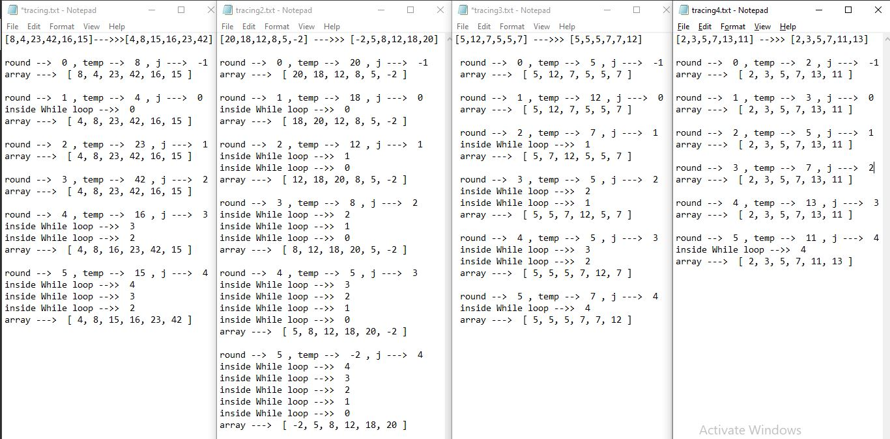

## Github actions
[link](https://github.com/ruwaid-401-advanced-javascript/data-structures-and-algorithms/pull/19/checks)

# Insertion Sort

## Approach & Efficiency

I used function, if statement, and loops.

### BIG O
#### insertion Sort Tree 
* breadthFirst method
  * space --> Big O = O(n) --> memory will depend on the original tree so it vary
  * time --> Big O = O(n^2) --> two nested loops


## Challenge
### Psedo code 

```
FOR i = 1 to arr.length  
  int j <-- i - 1
  int temp <-- arr[i]
      
  WHILE j >= 0 AND temp < arr[j]
    arr[j + 1] <-- arr[j]
    j <-- j - 1
      
  arr[j + 1] <-- temp

```

### Code 
``` 
function insetionSort(arr) {

  for (let i = 0; i < arr.length; i++) {
    let j = i - 1;
    let temp = arr[i];
    
    while (j >= 0 && temp < arr[j]) {
      arr[j + 1] = arr[j];      
      j--;
    }
    arr[j + 1] = temp;
  }
  return arr;

}
```

### test
```
describe('Insertion Sort', () => {
  it('Insertion Sort test ', () => {
    let testArr = [8, 4, 23, 42, 16, 15];
    expect(insertionSort(testArr)).toEqual([4,8, 15, 16, 23, 42]);
  });

  it('Insertion Sort test ', () => {
    let testArr = [20, 18, 12, 8, 5, -2];
    expect(insertionSort(testArr)).toEqual([-2, 5, 8, 12, 18, 20]);
  });

  it('Insertion Sort test ', () => {
    let testArr = [5, 12, 7, 5, 5, 7];
    expect(insertionSort(testArr)).toEqual([5, 5, 5, 7, 7, 12]);
  });

  it('Insertion Sort test ', () => {
    let testArr = [2,3,5,7,13,11];
    expect(insertionSort(testArr)).toEqual([2,3,5,7,11,13]);
  }); 
});

```

## Solution

