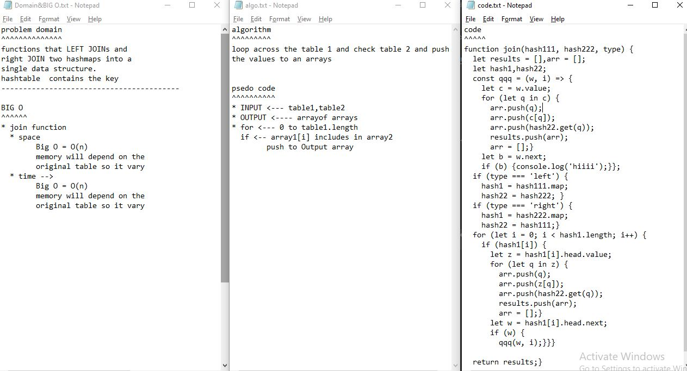

## Github actions
[link](https://github.com/ruwaid-401-advanced-javascript/data-structures-and-algorithms/pull/24/checks)

# hashtable

Write a function that LEFT JOINs two hashmaps into a single data structure.

## Challenge

functions that LEFT JOINs and right JOIN two hashmaps into a single data structure.
  hashtable  contains the key

## Approach & Efficiency

i used functions an if 
### BIG O
#### hashtable 
* join function
  * space --> Big O = O(n) -->  memory will depend on the original table so it vary
  * time --> Big O = O(n) -->  memory will depend on the original table so it vary

## Solution

