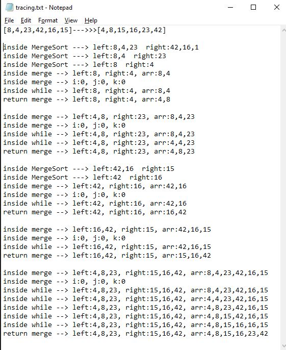

## Github actions
[link](https://github.com/ruwaid-401-advanced-javascript/data-structures-and-algorithms/pull/20/checks)

# Insertion Sort

## Approach & Efficiency

I used function, if statement, and loops.

### BIG O
#### insertion Sort Tree 
* breadthFirst method
  * space --> Big O = O(1) --> memory will depend on the original array
  * time --> Big O = O(nlog(n)) --> divide and conquer principle


## Challenge
### Psedo code 

```
ALGORITHM Mergesort(arr)
    DECLARE n <-- arr.length
           
    if n > 1
      DECLARE mid <-- n/2
      DECLARE left <-- arr[0...mid]
      DECLARE right <-- arr[mid...n]
      // sort the left side
      Mergesort(left)
      // sort the right side
      Mergesort(right)
      // merge the sorted left and right sides together
      Merge(left, right, arr)

ALGORITHM Merge(left, right, arr)
    DECLARE i <-- 0
    DECLARE j <-- 0
    DECLARE k <-- 0

    while i < left.length && j < right.length
        if left[i] <= right[j]
            arr[k] <-- left[i]
            i <-- i + 1
        else
            arr[k] <-- right[j]
            j <-- j + 1
            
        k <-- k + 1

    if i = left.length
       set remaining entries in arr to remaining values in right
    else
       set remaining entries in arr to remaining values in left

```

### Code 
``` 
function mergeSort(arr){
  const n = arr.length;
  let mid, left, right;
  if (n > 1) {
    mid = Math.ceil(n / 2);
    left = arr.slice(0, mid);
    right = arr.slice(mid, n);

    mergeSort(left);
    mergeSort(right);
    return merge(left, right, arr);
  }
  else{
    return arr;
  }
}

function merge(left, right, arr){
  let i = 0;
  let j = 0;
  let k = 0;

  while (i < left.length && j < right.length) {
    if (left[i] <= right[j]) {
      arr[k] = left[i];
      i++;
    } else {
      arr[k] = right[j];
      j++;
    }
    k++;
  }

  if (i === left.length) {
    for (j; j < right.length; j++) {
      arr[k] = right[j];
      k++;
    }
  } else {
    for (i; i < left.length; i++) {
      arr[k] = left[i];
      k++;
    }
  }
  return arr;
}
```

### test
```
describe('Merge Sort', () => {
  it('Merge Sort test ', () => {
    let testArr = [8, 4, 23, 42, 16, 15];
    expect(mergeSort(testArr)).toEqual([4, 8, 15, 16, 23, 42]);
  });

  it('Merge Sort test ', () => {
    let testArr = [20, 18, 12, 8, 5, -2];
    expect(mergeSort(testArr)).toEqual([-2, 5, 8, 12, 18, 20]);
  });

  it('Merge Sort test ', () => {
    let testArr = [5, 12, 7, 5, 5, 7];
    expect(mergeSort(testArr)).toEqual([5, 5, 5, 7, 7, 12]);
  });

  it('Merge Sort test ', () => {
    let testArr = [2, 3, 5, 7, 13, 11];
    expect(mergeSort(testArr)).toEqual([2, 3, 5, 7, 11, 13]);
  });
});

```

## Solution

