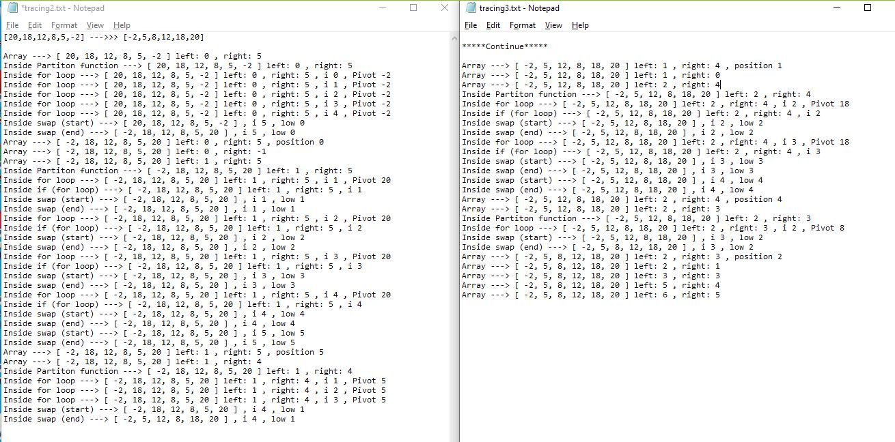

## Github actions
[link](https://github.com/ruwaid-401-advanced-javascript/data-structures-and-algorithms/pull/21/checks)

# Insertion Sort

## Approach & Efficiency

I used function, if statement, and loops.

### BIG O
#### Quick Sort Tree 
* quick Sort method
  * space --> Big O = O(1) --> memory will depend on the original array and some constant variables
  * time --> Big O = O(nlog(n)) --> divide and conquer principle


## Challenge
### Psedo code 

```
ALGORITHM QuickSort(arr, left, right)
    if left < right
        // Partition the array by setting the position of the pivot value 
        DEFINE position <-- Partition(arr, left, right)
        // Sort the left
        QuickSort(arr, left, position - 1)
        // Sort the right
        QuickSort(arr, position + 1, right)

ALGORITHM Partition(arr, left, right)
    // set a pivot value as a point of reference
    DEFINE pivot <-- arr[right]
    // create a variable to track the largest index of numbers lower than the defined pivot
    DEFINE low <-- left - 1
    for i <- left to right do
        if arr[i] <= pivot
            low++
            Swap(arr, i, low)

     // place the value of the pivot location in the middle.
     // all numbers smaller than the pivot are on the left, larger on the right. 
     Swap(arr, right, low + 1)
    // return the pivot index point
     return low + 1

ALGORITHM Swap(arr, i, low)
    DEFINE temp;
    temp <-- arr[i]
    arr[i] <-- arr[low]
    arr[low] <-- temp

```

### Code 
``` 
function QuickSort(arr, left, right) {
  if (left < right) {
    let position = Partition(arr, left, right);
    QuickSort(arr, left, position - 1);
    QuickSort(arr, position + 1, right);
  }
  return arr;
}
function Partition(arr, left, right) {
  let pivot = arr[right];
  let low = left - 1;
  for (let i = left; i < right; i++) {
    if (arr[i] <= pivot) {
      low = low + 1;
      Swap(arr, i, low);
    }
  }
  Swap(arr, right, low + 1);
  return low + 1;
}
function Swap(arr, i, low) {
  let temp;
  temp = arr[i];
  arr[i] = arr[low];
  arr[low] = temp;
}
```

### test
```
describe('quick Sort', () => {
  it('quick Sort test ', () => {
    let testArr = [8, 4, 23, 42, 16, 15];
    expect(quickSort(testArr,0,5)).toEqual([4, 8, 15, 16, 23, 42]);
  });

  it('quick Sort test ', () => {
    let testArr = [20, 18, 12, 8, 5, -2];
    expect(quickSort(testArr,0,5)).toEqual([-2, 5, 8, 12, 18, 20]);
  });

  it('quick Sort test ', () => {
    let testArr = [5, 12, 7, 5, 5, 7];
    expect(quickSort(testArr,0,5)).toEqual([5, 5, 5, 7, 7, 12]);
  });

  it('quick Sort test ', () => {
    let testArr = [2, 3, 5, 7, 13, 11];
    expect(quickSort(testArr,0,5)).toEqual([2, 3, 5, 7, 11, 13]);
  });
});

```

## Solution

