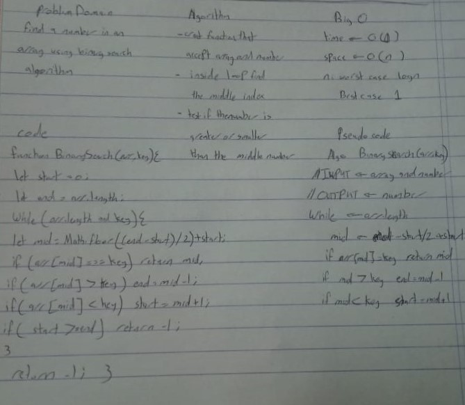

## Github actions
[link](https://github.com/ruwaid-401-advanced-javascript/data-structures-and-algorithms/pull/18/checks)

# Tree

Classes and functions

## Challenge

classes that have methods to get the maximum value in the tree

## Approach & Efficiency

i used classes anf recurssion
### BIG O
#### Binary Search Tree 
* MaximumTree method
  * space --> Big O = O(1) --> memory will be always constant
  * time --> Big O = O(h) --> depends on th height of the tree

## Solution

