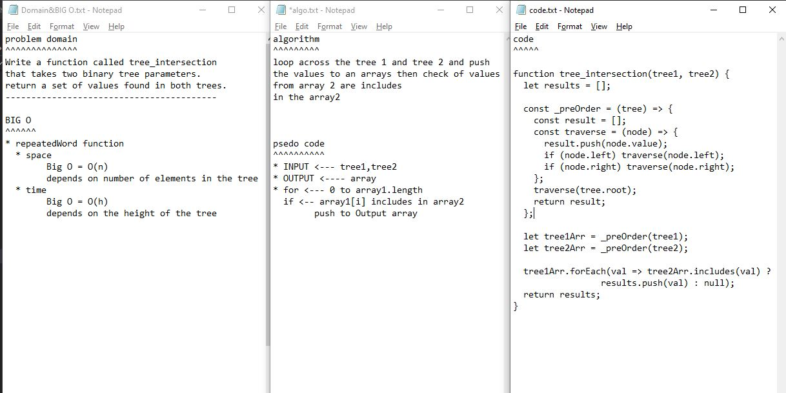

## Github actions
[link](https://github.com/ruwaid-401-advanced-javascript/data-structures-and-algorithms/pull/24/checks)

# tree_intersection
function

## Challenge

function to find the first repeated string

## Approach & Efficiency
loop and if

### BIG O
#### tree_intersection
* repeatedWord function 
  * space --> Big O = O(n) --> depends on number of elements in the tree
  * time --> Big O = O(h) --> depends on the height of the tree

## Solution

