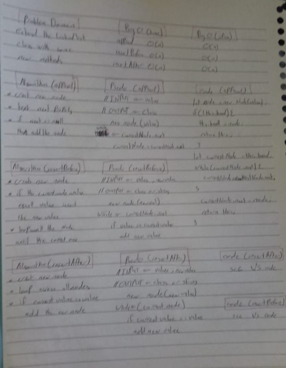

## Github actions
[link](https://github.com/ruwaid-401-advanced-javascript/data-structures-and-algorithms/pull/5/checks)

# Linked List 

Classes and loops

## Challenge

function that take an array and a number and add the number to the middle index of the array

## Approach & Efficiency

i used classes and while loop because i need to loop across all the elements
### BIG O
* append method
  * space --> Big O = O(n)
  * time --> Big O = O(n)
* insertBefore method 
  * space --> Big O = O(n)
  * time --> Big O = O(n)
* insertAfter method
  * space --> Big O = O(n)
  * time --> Big O = O(n)

## Solution

