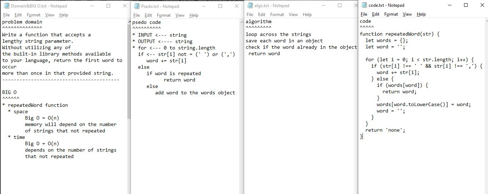

## Github actions
[link](https://github.com/ruwaid-401-advanced-javascript/data-structures-and-algorithms/pull/23/checks)

# repeated Word
function

## Challenge

function to find the first repeated string

## Approach & Efficiency
loop and if

### BIG O
#### Repeated-word
* repeatedWord function 
  * space --> Big O = O(n) --> memory will depend on the number of strings that not repeated
  * time --> Big O = O(n) --> depends on the number of strings that not repeated

## Solution

