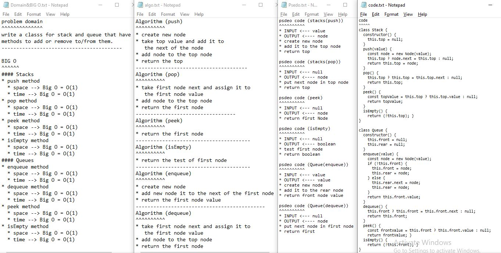

## Github actions
[link](https://github.com/ruwaid-401-advanced-javascript/data-structures-and-algorithms/pull/10/checks)

# Stacks-and-Queues

Classes and functions

## Challenge

classes that have methods to add or delete to the stacks and queues 

## Approach & Efficiency

i used classes 
### BIG O
#### Stacks
* push method
  * space --> Big O = O(1) --> constant time(no loops)
  * time --> Big O = O(1) --> constant time(no loops)
* pop method
  * space --> Big O = O(1) --> constant time(no loops)
  * time --> Big O = O(1) --> constant time(no loops)
* peek method
  * space --> Big O = O(1) --> constant time(no loops)
  * time --> Big O = O(1) --> constant time(no loops)
* isEmpty method
  * space --> Big O = O(1) --> constant time(no loops)
  * time --> Big O = O(1) --> constant time(no loops)
  
#### Queues
* enqueue method
  * space --> Big O = O(1) --> constant time(no loops)
  * time --> Big O = O(1) --> constant time(no loops)
* dequeue method
  * space --> Big O = O(1) --> constant time(no loops)
  * time --> Big O = O(1) --> constant time(no loops)
* peek method
  * space --> Big O = O(1) --> constant time(no loops)
  * time --> Big O = O(1) --> constant time(no loops)
* isEmpty method
  * space --> Big O = O(1) --> constant time(no loops)
  * time --> Big O = O(1) --> constant time(no loops)

## Solution

